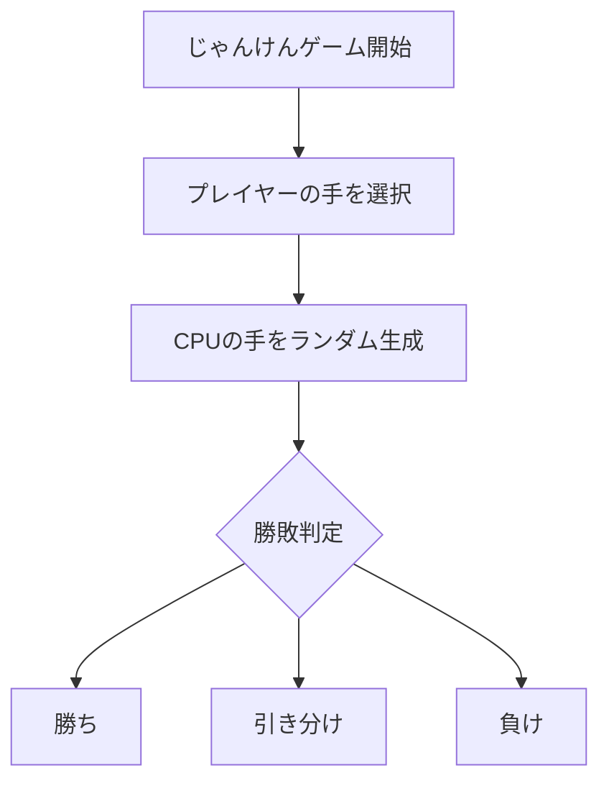
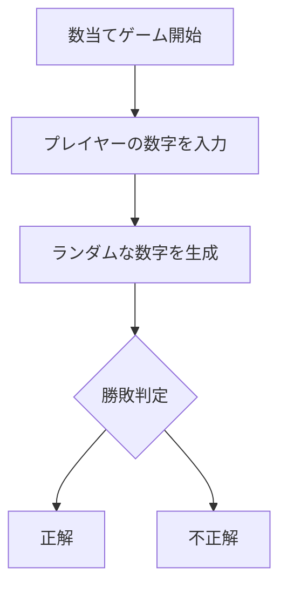
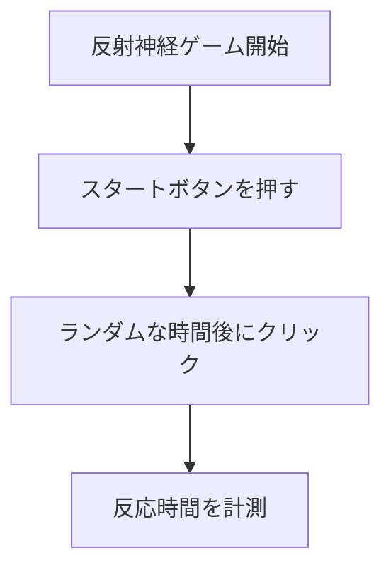

# webpro_06

### GithubのURL

### 起動方法
ターミナルでwpro/webpro_06を開く.
webpro_06ファイル内のターミナルで`node app5.js`と打ち，サーバーを起動する．
googleなどの検索アプリを開き，ブラウザでurlに`http://localhost:8080/ファイル名`と打つ．
(ファイル名には各自やりたいゲームファイル名を打つ．)

|ゲーム名|ファイル名|
|:---|:---:|
|じゃんけんゲーム|janken|
|数当てゲーム|guess|
|反射神経ゲーム|reaction|

ゲームの開始画面が表示されるので指示に従い，ゲームを開始する．

### ファイル名と説明

ファイル名|説明
-|-
app5.js|プログラムの本体
janken_form.ejs|じゃんけんの入力フォーム
janken_result.ejs|じゃんけんの結果ページ
guess_form.ejs|数当てゲームの入力フォーム
guess_result.ejs|数当てゲームの結果ページ
reaction_start.ejs|反射神経ゲームのスタートページ
reaction_result.ejs|反射神経ゲームの結果ページ

###　機能の説明

#### 1.app5.js

このプログラムは，以下の3つのミニゲーム機能を提供する．

 1. じゃんけんゲーム

##### 機能
- ユーザーが「グー」「チョキ」「パー」の中から選択し,コンピュータ（CPU）とじゃんけんをする．
- 勝敗は以下のロジックに基づいて決定される:
  - **勝ち:** ユーザーが「グー」でCPUが「チョキ」など．
  - **引き分け:** 両者が同じ手を出した場合．
  - **負け:** CPUに負ける場合．
- 勝利数と試合数を記録して，結果を表示する．

##### 実行フロー
1. ユーザーがじゃんけんの手を選択し，フォームを送信する．
2. サーバー側でCPUの手をランダム生成．
3. 勝敗を判定し，結果をテンプレートで表示．

##### エンドポイント
- **GET `/janken`**: じゃんけんフォームを表示．
- **POST `/janken`**: 結果を計算して表示．

---

#### 2. 数当てゲーム

###### 機能
- ユーザーが1～10の数字を入力し，サーバーが生成するランダムな数字と一致するかを当てるゲーム．
- ユーザーが正解した場合，勝利数を1増やす．
- 不正解の場合，サーバー側で生成された正解の数字をユーザーに表示する．
- ユーザーの試行回数も記録する．

##### 実行フロー
1. ユーザーが数字を入力し，フォームを送信する．
2. サーバー側で1～10のランダムな数字を生成する．
3. 入力値とランダムな数字を比較し，正解または不正解のメッセージを表示する．

##### エンドポイント
- **GET `/guess`**: 数当てゲームのフォームを表示．
- **POST `/guess`**: 結果を計算して表示．

---

#### 3. 反射神経ゲーム

###### 機能
- ユーザーの反射神経を測定するシンプルなゲーム.
- スタートボタンを押した後，一定の時間が経過してからクリックする反応時間を記録．
- 計測結果を表示する．

##### 実行フロー
1. ユーザーがスタートボタンを押す．
2. ユーザーの反射時間を計測する（フロントエンドで計測が想定される）．
3. 記録された反射時間をサーバーに送信し，結果を表示する．

##### エンドポイント
- **GET `/reaction`**: 反射神経ゲームのスタートページを表示.
- **POST `/reaction`**: 反応時間を受け取って表示.

---

#### 必要なテンプレート
このプログラムは，以下のテンプレートファイルが必要である:
1. **`janken_form.ejs`**: じゃんけんの入力フォーム．
2. **`janken_result.ejs`**: じゃんけん結果ページ．
3. **`guess_form.ejs`**: 数当てゲームの入力フォーム．
4. **`guess_result.ejs`**: 数当てゲーム結果ページ．
5. **`reaction_start.ejs`**: 反射神経ゲームのスタートページ．
6. **`reaction_result.ejs`**: 反射神経ゲーム結果ページ．

---
---

#### 2. janken_form.ejs

このHTMLファイルは，じゃんけんゲームの入力フォームを提供するシンプルなウェブページである．

##### 機能概要
- ユーザーが「グー」「チョキ」「パー」から選択できるプルダウンメニューを表示する．
- 入力されたデータを **POST** メソッドを用いてサーバーに送信する．
- サーバー側で送信されたデータを受け取り，じゃんけんの結果を計算する．

---

##### HTML構造の説明

##### `<title>`
- ページタイトルを設定する．
  - **内容:** 「じゃんけん」

##### `<h1>`
- ページの見出しを設定する．
  - **内容:** 「じゃんけんゲーム」

##### `<form>`
- サーバーへのデータ送信フォームを作成する．
- **属性:**
  - `action="/janken"`: サーバーの `/janken` エンドポイントにデータを送信．
  - `method="POST"`: POSTメソッドを使用してデータを送信．

##### フォームの中身
1. **ラベルとセレクトメニュー**
   - ユーザーが「グー」「チョキ」「パー」を選択できる．
   - **`<label>` と `<select>` の設定:**
     - `<label for="hand">`: `id="hand"` を持つ要素に対応するラベル．
     - `<select id="hand" name="hand" required>`:
       - **`name="hand"`**: 選択した手をPOSTデータとして送信．
       - **`required`**: 必須入力．

   - **選択肢 (`<option>`) の内容:**
     - 「グー」
     - 「チョキ」
     - 「パー」

2. **隠しフィールド**
   - ユーザーの勝利数と試合数を初期化するためのフィールド。
   - **`<input type="hidden">` の設定:**
     - **`name="win"`**: 勝利数を記録（初期値 `0`）．
     - **`name="total"`**: 試合数を記録（初期値 `0`）．

3. **送信ボタン**
   - **`<button type="submit">`:**
     - 「勝負！」のテキストを表示するボタン．
     - 押すとフォーム内容がサーバーに送信される．

---

##### このページの利用方法
1. ページをブラウザで表示する．
2. プルダウンメニューから「グー」「チョキ」「パー」のいずれかを選択する．
3. 「勝負！」ボタンをクリックする．
4. データがサーバーに送信され、じゃんけんの結果が計算される．

--- 
---
##### 3. janken_result.ejs
###### じゃんけん結果ページ

このHTMLファイルは，じゃんけんの結果を表示するページである．

###### 機能概要
- ユーザーの手，CPUの手，勝敗結果，勝利数，試合数を画面に表示する．
- ユーザーが再挑戦できるリンクを提供します．

---

##### HTML構造の説明

##### `<title>`
- ページタイトルを設定する．
  - **内容:** 「じゃんけん結果」

##### `<h1>`
- 見出しを設定する．
  - **内容:** 「結果」

##### `
`
- 結果の詳細を表示する．
  - **内容:**
    - ユーザーの手: `<%= hand %>`
    - CPUの手: `<%= cpu %>`
    - 勝敗結果: `<%= judgement %>`
    - 勝利数: `<%= win %>`
    - 試合数: `<%= total %>`

##### `<a href="/janken">`
- 再挑戦用のリンク．
  - **表示:** 「もう一度勝負」
  - **遷移先:** `/janken` ページ．

---

##### このページの利用方法
- ユーザーがじゃんけんをプレイした後，このページに結果が表示される．
- 「もう一度勝負」をクリックすることで，じゃんけんフォームに戻り再挑戦できる．

---
---

#### 4. guess_form.ejs

##### 数当てゲーム フォームページ

このHTMLファイルは，数当てゲームの入力フォームを提供するページである．

###### 機能概要
- ユーザーが1〜10の数字を入力し，サーバーに送信する．
- 勝利数や試行回数を記録する隠しフィールドを利用する．

---

###### HTML構造の説明

###### `<title>`
- ページタイトルを設定する．
  - **内容:** 「数当てゲーム」

##### `<h1>`
- 見出しを設定する．
  - **内容:** 「数当てゲーム」

##### `
`
- ゲームの説明を表示．
  - **内容:** 「1〜10の間で数を当ててください！」

##### `<form>`
- 数字入力フォームを作成する．
- **属性:**
  - `action="/guess"`: サーバーの `/guess` エンドポイントにデータを送信．
  - `method="POST"`: POSTメソッドでデータを送信．

##### フォームの中身
1. **数字入力フィールド**
   - **`<input type="number">` の設定:**
     - **`id="number" name="number"`**: ユーザーが選択した数字を送信．
     - **`min="1" max="10"`**: 入力範囲を制限．
     - **`required`**: 必須入力．

2. **隠しフィールド**
   - 勝利数と試行回数をサーバーに送信．
   - **`<input type="hidden">` の設定:**
     - **`name="win"`**: 勝利数を記録．
     - **`name="attempts"`**: 試行回数を記録．

3. **送信ボタン**
   - **`<button type="submit">`**: ユーザーの入力を送信．

---

##### このページの利用方法
1. ページを表示し，1〜10の間の数字を入力します．
2. 「送信」ボタンを押すと，データがサーバーに送信され，結果が計算される．

---
---

#### 5. guess_result.ejs

##### 数当てゲーム結果ページ

このHTMLファイルは数当てゲームの結果を表示するページである．

##### 機能概要
- ユーザーが選んだ数，正解の数，メッセージ，勝利数，試行回数を画面に表示する.
- ユーザーが再挑戦できるリンクを提供する.

---

##### HTML構造の説明

##### `<title>`
- ページタイトルを設定している.
  - **内容:** 「数当てゲーム結果」

##### `<h1>`
- 見出しを設定している.
  - **内容:** 「結果」

##### `
`
- 結果の詳細を表示する.
  - **内容:**
    - ユーザーが選んだ数: `<%= userNumber %>`
    - 正解の数: `<%= randomNumber %>`
    - メッセージ: `<%= message %>`
    - 勝利数: `<%= win %>`
    - 試行回数: `<%= attempts %>`

##### `<a href="/guess">`
- 再挑戦用のリンク.
  - **表示:** 「もう一度挑戦」
  - **遷移先:** `/guess` ページ.

---

##### このページの利用方法
- 数当てゲームをプレイした後，このページで結果を確認する.
- 「もう一度挑戦」をクリックすると，ゲームフォームに戻り再挑戦できる.

---
---

#### 6. reaction_start.ejs

##### 反射神経ゲームページ

このHTMLファイルは、反射神経ゲームを実行するインタラクティブなページである.

##### 機能概要
- ユーザーが「スタート」ボタンを押すと，2〜5秒後にクリックを促すメッセージが表示される.
- ユーザーのクリック反応時間を計測し，サーバーに送信する.

---

##### HTML構造の説明

##### `<title>`
- ページタイトルを設定している.
  - **内容:** 「反射神経ゲーム」

##### `<h1>`
- 見出しを設定している.
  - **内容:** 「反射神経ゲーム」

##### `
`
- ユーザーへのメッセージを表示する.
  - 初期メッセージ: 「スタートボタンを押してください.」
  - スタート後: 「準備中...」 → 「クリック！」

##### `<button onclick="startGame()">`
- ゲームを開始するボタン.
  - クリックすると `startGame()` 関数が呼び出され、ランダムな遅延後にクリックを求める.

##### `<form id="reactionForm">`
- 反応時間をサーバーに送信するためのフォーム.

##### 隠しフィールド
- **`<input type="hidden" name="reactionTime">`:**
  - ユーザーの反応時間を記録するフィールド.

##### クリックボタン
- **`<button id="reactionButton">`:**
  - 初期状態では無効化されている (`disabled`).
  - ゲームがスタート後に有効化され，クリックで `recordReaction()` を実行.

---

##### スクリプトの説明

##### `startGame()`
- ランダムな2〜5秒の遅延を設定.
- 遅延後、「クリック！」というメッセージを表示し、クリックボタンを有効化.
- 反応時間計測の開始時刻を記録 (`window.startTime`).

##### `recordReaction()`
- 現在時刻から開始時刻を引いて反応時間を計算.
- 反応時間を隠しフィールドにセットし，フォームを送信.

---

##### このページの利用方法
1. 「スタート」ボタンを押す.
2. 表示が「クリック！」に変わったら，できるだけ早く「ここをクリック！」ボタンを押す.
3. 結果はサーバーに送信され，次のページで確認できる.

---
---
#### 7. reaction_result.ejs

##### 数当てゲーム結果ページ

このHTMLファイルは数当てゲームの結果を表示するページである．

---

##### 機能概要
- ユーザーが選んだ数，正解の数，メッセージ，勝利数，試行回数を画面に表示する．
- ユーザーが再挑戦できるリンクを提供する．

---

##### HTML構造の説明

###### `<title>`
- ページタイトルを設定している．
  - **内容:** 「数当てゲーム結果」

###### `<h1>`
- 見出しを設定している．
  - **内容:** 「結果」

###### `
`
- 結果の詳細を表示する．
  - **内容:**
    - ユーザーが選んだ数: `<%= userNumber %>`
    - 正解の数: `<%= randomNumber %>`
    - メッセージ: `<%= message %>`
    - 勝利数: `<%= win %>`
    - 試行回数: `<%= attempts %>`

###### `<a href="/guess">`
- 再挑戦用のリンク．
  - **表示:** 「もう一度挑戦」
  - **遷移先:** `/guess` ページ．

---

##### このページの利用方法
- 数当てゲームをプレイした後，このページで結果を確認する．
- 「もう一度挑戦」をクリックすると，ゲームフォームに戻り再挑戦できる．

### フローチャート

1.じゃんけんゲーム

2.数当てゲーム

3.反射神経ゲーム

